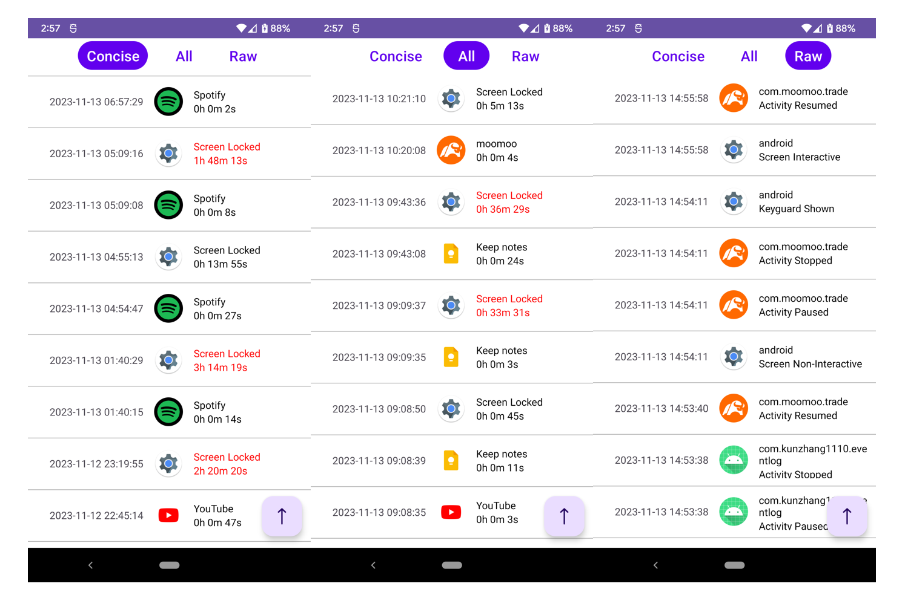

# Event Log

Event Log provides an easy way to check Android phone usage events.

## Description

This Android application translates data collected by UsageStatsManager
into three different human-readable formats as follows:

| **Format** | **Descriptions**                                           |
|------------|------------------------------------------------------------|
| Concise    | shows only “Screen Locked” activities and their durations. |
| All        | shows all Apps' usage duration (excluding system apps).    |
| Raw        | shows all raw events with their associated package names.  |

Users can switch between these formats easily by using buttons at the
top of the app. In both the. Concise and All formats, activities with
durations exceeding 30 minutes are highlighted in red.". Swiping down
will immediately refresh and update new entries.

## Getting Started

Download the EventLog.apk under /release directory and install it.

### Permissions

PACKAGE_USAGE_STATS is required for using UsageStatsManager API and
QUERY_ALL_PACKAGES is required for getting App icons for all installed
apps.

Users need to grant these two permissions on their phones by navigating
to Settings \> Special app access \> Usage Access and toggling it on.
