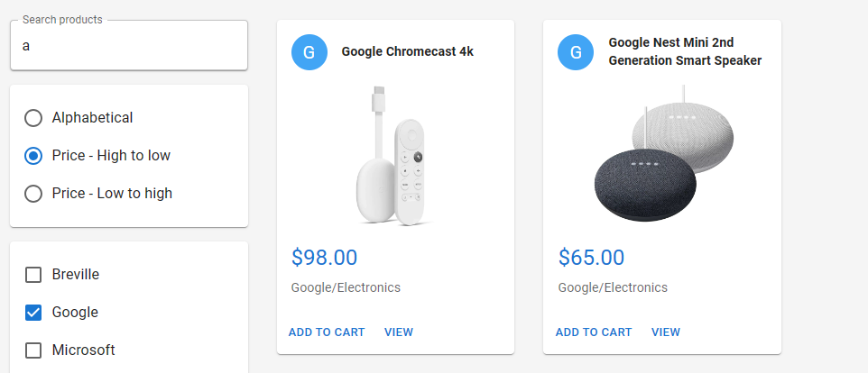
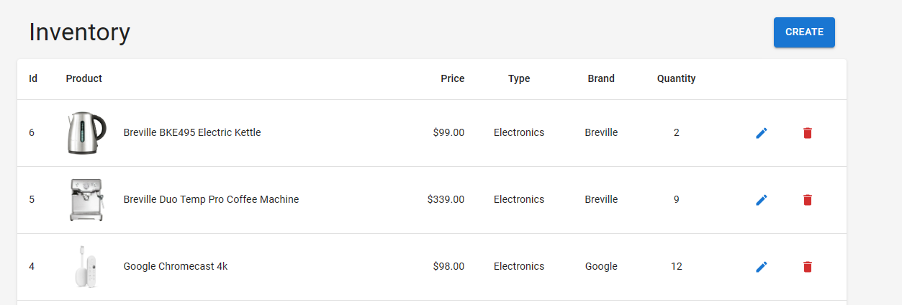
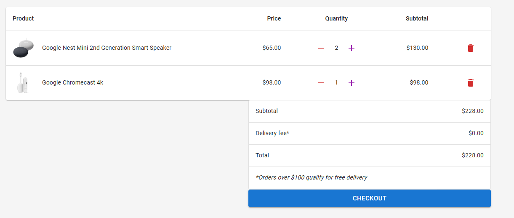
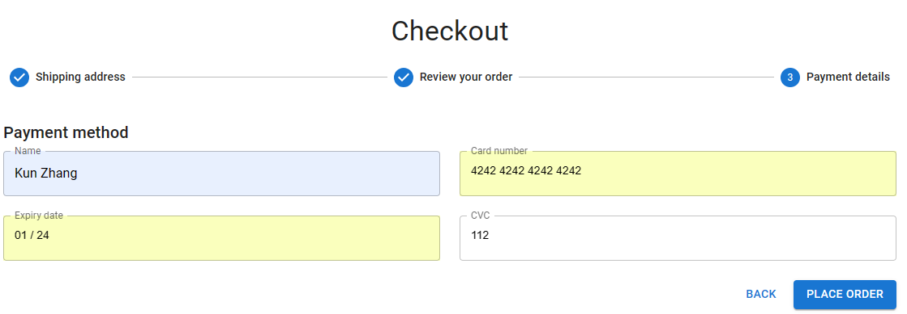
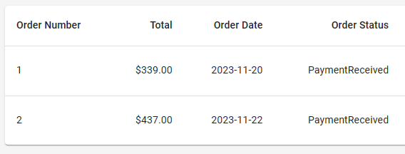

# My Shop

This repository contains the source code for my e-commerce website,
using ASP.NET Core backend, React.js with TypeScript frontend, and SaaS
integrations such as Stripe for payments and Cloudinary for image
storage. Access the website at
<https://myshop20230101.azurewebsites.net>.

## Getting Started

Clone the repository and run in development mode in Visual Studio.
Register with Stripe and Cloudinary to enable payment services and image
storage services.

### Testing Accounts

Use the following accounts to log in. An administrator user can create
or update products while a normal user cannot.

| **Username** | **Email**   | **Password** | **Role**      |
|--------------|-------------|--------------|---------------|
| a            | a@a.com     | Zk000000!    | User          |
| admin        | admin@a.com | Zk000000!    | Administrator |

### Secrets

Secrets need to be stored in

- MyShop/appSettings.Development.json

- client/.env.development

Required secrets:

- ConnectionStrings - DefaultConnection : the database connection string

- JWTSettings - TokenKey: can be any random key

- StripeSettings

  - Public key and secret key can be found in *Developer - API Keys*

  - Add a new endpoint in Developer - Webhook with the URL suffix
    /api/payments/webhook. The signing key of the newly added endpoint
    serves as the webhook secret.

<!-- -->

- CloudinarySettings

  - Login with Github. In Dashboard, find Cloudname, ApiKey, ApiSecrets.

### Stripe Testing Card

Use the Stripe testing card to make a payment. The payment card has the
following details.

- Card No. 4242 4242 4242 4242

- Name, Date and CVC can have any value.

## Features

Users can search for a product, sort and filter products.

An administrator user gains access to Inventory page where he can create
or update products.

When a non-logged-in user adds items to the basket, the server assigns a
buyerId and stores it in a cookie. Upon returning to the web app, the
user retains their basket items. During checkout, the app prompts the
user to log in or register.

Users can modify their baskets before checking out.

When checkout, the payment is made to Stripe not to the web server.

Users can view whether their payment is pending or has been received.

## Build With

Backend - ASP.NET Core with

- AutoMapper

- CloudinaryDotNet

- Stripe.net

Frontend - React Typescript with

- Axios

- Mui

- react-dropzone

- react-hook-form

- React Redux

- React Router

- react-toastify

- react-slick: React port of slick carousel

- yup: for react-hook-form input validation

SaaS

- Cloudinary

- Stripe
